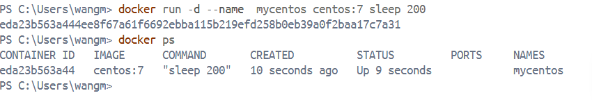
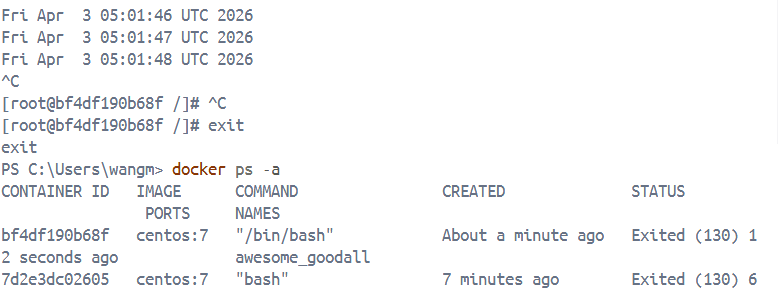
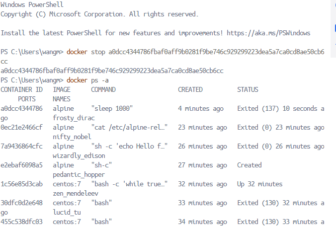

# Unit 2: Working with Docker Images and Containers

## Docker Images – The Blueprint

A Docker image is a read-only, static template that serves as the foundation for creating containers.  
Think of it like a recipe or a snapshot: it contains everything your application needs to run — the operating system files, runtime environment, system libraries, application code, and configuration settings.  
Images are built from a set of instructions written in a Dockerfile and can be stored in registries like Docker Hub for sharing and reuse.

---

## Docker Containers – The Running Instances

A container is what you get when you launch a Docker image.  
It is a live, running, isolated environmentwhere your application actually executes.  
While an image is static (read-only), a container adds a writable layer on top of the image, allowing your application to create logs, modify files, and store temporary data.  
You can start, stop, restart, or delete a container without affecting the underlying image.


---

##  Essential Docker Commands for Images and Containers

Below are the most frequently used commands to manage images and containers. Replace `<container>` or `<image>` with actual names or IDs.


### Working with Containers

```bash
docker run <image>            # Create and start a new container from an image (downloads the image first if not present)
docker ps                     # List only running containers 
docker ps -a                  # List all containers (including stopped ones) 
docker stop <container>       # Gracefully stop a running container
docker start <container>      # Start a stopped container
docker restart <container>    # Restart a container (equivalent to stop then start)
docker rm <container>         # Remove a stopped container (use -f to force remove a running container)
```
## Sreenshots
- docker ps

- docker ps -a

- docker stop

--- 
## Running Containers
```bash
docker run nginx          # Run nginx container
docker run -it ubuntu bash # Run ubuntu interactively
```
### Port Mapping
- Connect your container to your system using ports:
```bash
docker run -p 8080:80 nginx
```
- port 8080 is my system whereas to port 80 is the container
### Detached Mode
- Run container in background
``` bash
docker run -d nginx
```
### Docker Exec (Run Commands Inside Container)
- Run commands inside a running container.
``` bash
docker exec <container_id> cat /etc/os-release
```